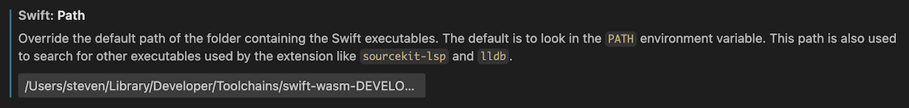

# Examples of Swift for WebAssembly

This repository contains a set of examples that show how you can use [SwiftWasm](https://swiftwasm.org) to compile Swift code to WebAssembly and run it in a browser.

## Contents

The following examples must be read in order, and before any others:

1. [The Basics](basics/README.md)
2. [A WebAssembly Command](command/README.md)
3. [A WebAssembly Reactor](reactor/README.md)
4. [Exporting Functions](export/README.md)
5. [Importing Functions](import/README.md)

These can be read in any order:

- [Strings and Codables](strings/README.md)
- [Connect Four](connect-four/README.md)

## Installation

There are two ways to install SwiftWasm:

1. Download and install a SwiftWasm toolchain
2. Download and install a SwiftWasm SDK for a regular Swift toolchain

Toolchains involve large downloads but require less configuration. The examples in this repository use toolchains by default, so if you want to go this route, simply follow along with the examples.

SDKs are still experimental and require a bit more configuration. However, they will become the recommended way to install SwiftWasm in the near future. If you want to try out SDKs, read the following paragraph.

## Using SDKs

> ⚠️ Skip this paragraph if you're going to use a SwiftWasm toolchain.

### Installing a toolchain

SwiftWasm SDKs require a compatible toolchain from [Swift.org](https://www.swift.org). Toolchains bundled with Xcode are not supported yet.

Go to the [SwiftWasm release page](https://github.com/swiftwasm/swift/releases) to find the latest release of SwiftWasm, and check which version of the Swift toolchain is required. For example:


This shows that the SwiftWasm snapshot from September 7 requires the toolchain snapshot from September 6. Later releases will require more recent toolchains.

Download the toolchain you need from [Swift.org](https://www.swift.org/install/) and install it.

All subsequent instructions assume that you're using this toolchain. You may want to make it your default toolchain by setting either the **PATH** variable on Linux, or the **TOOLCHAINS** variable on macOS (as described [here](https://www.swift.org/install/macos/package_installer/)).

### Installing an SDK

Now that you have the required toolchain, you can install the corresponding SDK. The command you need is listed on the [SwiftWasm release page](https://github.com/swiftwasm/swift/releases).

For example, for the September 7 snapshot, this command is:

```
swift sdk install https://github.com/swiftwasm/swift/releases/download/swift-wasm-DEVELOPMENT-SNAPSHOT-2024-09-07-a/swift-wasm-DEVELOPMENT-SNAPSHOT-2024-09-07-a-wasm32-unknown-wasi.artifactbundle.zip --checksum dd43e067cccee3051b5fee16b5b2850943e57aea216948b4934a97b11901bfc2
```

Run `swift sdk list` to verify the SDK was installed correctly, and to see its ID:

```
❯ swift sdk list
DEVELOPMENT-SNAPSHOT-2024-09-07-a-wasm32-unknown-wasi
```

You'll use this ID to refer to the SDK in build commands and configuration files.

### Building with an SDK

To use an SDK, adjust the build commands in the examples as follows.

For examples that use **carton**, replace:

```
swift run carton dev
```

with:

```
swift package --disable-sandbox --swift-sdk <id> carton-dev
```

where `<id>` is a placeholder for the ID of your SDK.

Perform similar replacements for other **carton** subcommands, such as `bundle`, which becomes:

```
swift package --disable-sandbox --swift-sdk <id> carton-bundle
```

For examples that use a **buildAndRun.sh** script, adjust the script as follows:

- Set the `TOOLCHAIN` variable to the toolchain you installed from Swift.org, not the SwiftWasm toolchain.
- Replace `--triple wasm32-unknown-wasi` with `--swift-sdk <id>`.

## Configuring Visual Studio Code

SwiftWasm can be tricky to work with as it involves cross-compiling for a different architecture. Therefore, it's important that you have a clear understanding of what you're doing, and that you properly configure your IDE.

I recommend that you configure Visual Studio Code to use the same toolchain you're using to build for WebAssembly. Open Settings and navigate to **Extensions** ▸ **Swift** ▸ **Path**. Here, enter the path where Carton installed a SwiftWasm toolchain, followed by **/usr/bin**:



For example, on my machine, using the September 7 snapshot, this path is:

```
/Users/steven/Library/Developer/Toolchains/swift-wasm-DEVELOPMENT-SNAPSHOT-2024-09-07-a.xctoolchain/usr/bin
```

If you're using an SDK, enter the path to the toolchain you downloaded from Swift.org instead. In my case, that would be:

```
/Users/steven/Library/Developer/Toolchains/swift-DEVELOPMENT-SNAPSHOT-2024-09-06-a.xctoolchain/usr/bin
```

Next, understand that features powered by SourceKit-LSP, such as error highlighting and code completion, will not work until you build your project for your machine's native architecture as well.

If you're using an SDK, you can configure SourceKit-LSP to use this SDK, which removes the need for an additional build. To do this, add a **.sourcekit-lsp/config.json** file to your project, with the following contents:

```json
{
    "swiftPM": {
        "swiftSDK": "<id>"
    }
}
```

where `<id>` is a placeholder for the ID of your SDK, as shown by `swift sdk list`.

## Useful links

- Swift:
    - [**SwiftWasm**](https://swiftwasm.org)
    - [**Carton**](https://github.com/swiftwasm/carton)
    - [**JavaScriptKit**](https://github.com/swiftwasm/JavaScriptKit)
- WebAssembly:
    - [**WebAssembly**](https://webassembly.org)
    - [**WASI**](https://wasi.dev)
    - [**Command vs. Reactor**](https://github.com/WebAssembly/WASI/blob/main/legacy/application-abi.md)
