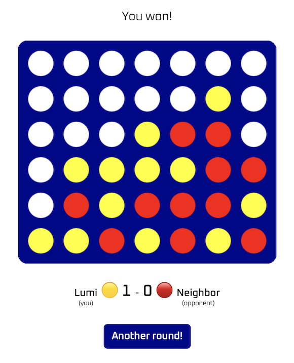

# Connect Four

This example implements a game of Connect Four with online multi-play:



It consists of the following components:

- **Shared**: A platform-independent library that provides an implementation of Connect Four and its multiplayer functionality.
- **Front-end**: A SwiftWasm project that relies on Carton and JavaScriptKit to build a web front-end. The structure of this project is similar to [Basics](../basics/README.md).
- **Back-end**: A [Vapor](https://vapor.codes) back-end that uses websockets to connect players and forward a player's actions to their opponent.

## Goals

The goals for this example were twofold:

1. Achieve code reuse by building a web front-end for a Swift library that provides the game logic
2. Further explore Carton and JavaScriptKit

Therefore, the UI for this game is entirely written in Swift, using JavaScriptKit to interact with the DOM.

## Running the example

Use the **buildAndRun.sh** script to compile and run this example. This script will compile the front-end, copy the resulting static files to the back-end, and serve them from there.

Alternatively, you can run the example using Docker:

```
docker compose up
```

The game will be served at http://127.0.0.1:9090/.

You can connect using multiple browsers to test the multiplayer functionality.
